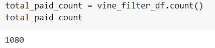
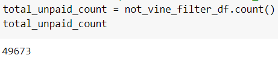
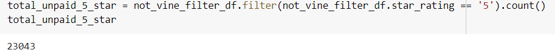
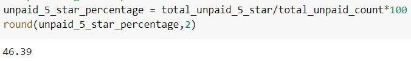

# Amazon_Vine_Analysis

## Purpose
To analyze Amazon reviews and determine if there are any bias between Amazon Vine members and non-Vine members using Google Colaboration Notebook and PySpark 3.0.3.

## Result
Our analysis performs an extract, transform, and load (ETL) process using the AWS RDS batabase connected to our pgAdmin and PySpark (in Google Colab) to calculate our results. In our analysis, we used the dataset provided by [this open data from AWS](https://s3.amazonaws.com/amazon-reviews-pds/tsv/amazon_reviews_us_Electronics_v1_00.tsv.gz) which consists of Amazon reviews on Electronics in the US.

### Total Number of Reviews
#### Total Vine Reviews

- Our analysis showed that there were 1,080 total paid reviews.
#### Total Non-Vine Reviews

- Our analysis showed that there were 49,673 total unpaid reviews.

### Total Number of 5-Star Reviews
#### Total 5-Star Vine Reviews

- Our analysis showed that there were 454 total paid 5-star reviews.
#### Total 5-Star Non-Vine Reviews

- Our analysis showed that there were 23,043 total unpaid reviews.

### Percentage of 5-Star Reviews
#### 5-Star Paid Reviews Percentage

- 42.04% of our paid reviews are 5-stars.
#### 5-Star Unpaid Reviews Percentage

- 46.39% of our unpaid reviews are 5-stars.

## Summary
Our analysis suggests that there is a slight negative bias towards our Vine (paid) members' 5-star reviewers, 42.04% vs 46.39%. With only around 4% difference between our paid and unpaid reviewers. We can further analyze the reviews across all ratings to see the statistical distribution of Vine and non-Vine reviews.